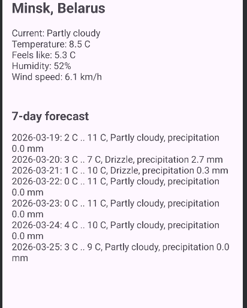
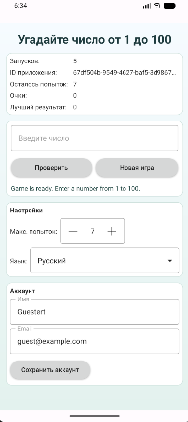
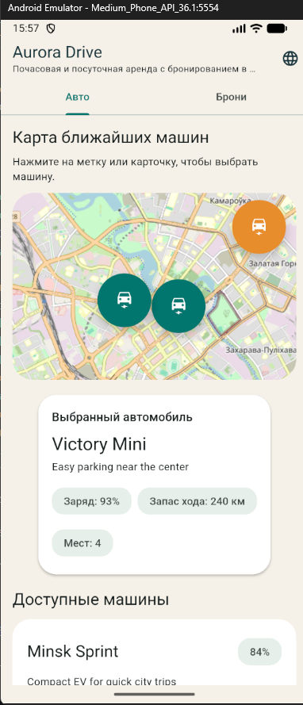

# Отчет по переводу заданий на мультиплатформенную сборку

## Общая цель

В репозитории были доведены четыре задания так, чтобы они собирались и тестировались как кроссплатформенные проекты в рамках выбранных стеков:

- `Task1-WeatherApplication` — Compose Multiplatform
- `Task2-MyCalc` — Compose Multiplatform
- `Task3-Caclulator_Qt` — Qt Quick / QML + CMake
- `Task4-AuroraCar` — Flutter

Также были добавлены и обновлены GitHub Actions для автоматической сборки соответствующих платформ.

## Задание 1. WeatherApplication

Что было сделано для перехода на мультиплатформенную сборку:

- Актуализирован workflow `.github/workflows/task1.yml`.
- В CI выделены отдельные задания для:
  - Android
  - Desktop/Linux JVM
  - Web/Wasm
  - iOS Simulator
- Команды сборки в CI переведены на вызов через `bash ./gradlew`, чтобы workflow не зависел от executable bit у `gradlew`.
- Исправлена конфигурация Gradle:
  - добавлен `@OptIn(ExperimentalWasmDsl::class)` для `wasmJs`
  - добавлено подавление предупреждения совместимости Kotlin Multiplatform и AGP
  - скорректирован режим резолва репозиториев в `settings.gradle.kts`, чтобы Kotlin/Native toolchain и Compose-зависимости корректно подтягивались при CI-сборке

Итог:

- проект остается на единой кодовой базе Compose Multiplatform
- GitHub Actions собирает и проверяет Android, Desktop, Web и iOS-таргеты

Скриншот:

## Задание 2. MyCalc

Что было сделано для перехода на мультиплатформенную сборку:

- Добавлен новый workflow `.github/workflows/task2.yml`.
- В CI вынесены отдельные jobs для:
  - Android
  - Desktop/Linux JVM
  - Web/Wasm
  - iOS Simulator
- Унифицирована структура CI с первым заданием.
- Исправлена сборочная конфигурация Gradle:
  - добавлен `@OptIn(ExperimentalWasmDsl::class)` для `wasmJs`
  - добавлено подавление предупреждения о совместимости Kotlin Multiplatform и Android Gradle Plugin
  - изменен режим работы с репозиториями в `settings.gradle.kts`, чтобы сборка не падала на этапе конфигурации

Итог:

- проект собирается как Compose Multiplatform-приложение под Android, iOS, Desktop и Web
- для репозитория добавлен отдельный CI-конвейер

## Задание 3. Qt Quick / QML

Что было сделано для перехода на мультиплатформенную сборку:

- Добавлен workflow `.github/workflows/task3.yml`.
- В GitHub Actions предусмотрены отдельные jobs для:
  - Linux Desktop
  - WebAssembly
  - Android
  - iOS Simulator
- Для Linux Desktop добавлена автоматическая сборка и прогон unit tests через `ctest`.
- CMake-конфигурация приведена к более чистому и согласованному виду:
  - проект переименован логически в `task3`
  - QML module URI приведен к `task3`
  - добавен модуль `Qt6::Sql`
- Переработано хранение состояния:
  - на native-платформах используется SQLite-backed хранилище
  - для сценариев, где SQLite может быть недоступен или неудобен, оставлен fallback backend
- В `GameViewModel` добавлена история действий пользователя:
  - список последних событий
  - очистка истории
  - сохранение истории между запусками
- Интерфейс `Main.qml` сделан более адаптивным:
  - поддержка узких и широких экранов
  - улучшен desktop/mobile-friendly layout
  - добавлены блоки статистики, аккаунта, истории и настроек
- Расширена локализация:
  - обновлены переводы для русского и белорусского языков
- Расширены тесты:
  - проверка сохранения истории
  - проверка поведения `GameViewModel`

Итог:

- шаблон Qt/QML-приложения подготовлен к кроссплатформенной сборке через CMake
- добавлен CI для desktop/mobile/web-направлений
- логика хранения и UI стали более пригодными для мультиплатформенного сценария

Скриншот:

## Задание 4. Flutter

Что было сделано для перехода на мультиплатформенную сборку:

- Добавлен workflow `.github/workflows/task4.yml`.
- В CI вынесены отдельные jobs для:
  - анализ и тесты
  - Web build
  - Linux build
  - Android build
  - iOS simulator build
- Переработан слой локального хранения:
  - убрана зависимость активной логики от `sqflite`
  - бронирования и кеш переведены на кроссплатформенное хранение через `SharedPreferences`
  - это позволило использовать одну реализацию данных для Android, iOS, Linux и Web
- Добавлена поддержка сохраненной сессии:
  - создан `SessionProvider`
  - реализован экран входа
  - добавлено восстановление и сброс сессии
- Добавлена поддержка темы:
  - создан `ThemeProvider`
  - реализованы режимы `system`, `light`, `dark`
- Добавлен экран настроек:
  - переключение темы
  - переключение языка
  - очистка кеша
  - выход из аккаунта
- Главный экран переработан в адаптивный shell:
  - на узких экранах используется нижняя навигация
  - на широких экранах используется `NavigationRail`
  - разделы приложения лучше адаптированы под desktop/web layout
- Усилено тестовое покрытие:
  - дополнены provider-тесты
  - добавлены widget-тесты на вход, локализацию и отмену бронирования
  - расширены integration tests для сценариев входа и очистки кеша

Итог:

- Flutter-приложение переведено в более реальное мультиплатформенное состояние
- единая кодовая база теперь лучше подходит для Android, iOS, Linux и Web
- добавлены CI-сборки и тестовые проверки

Скриншот:

## Что добавлено в GitHub Actions

В репозиторий добавлены/обновлены следующие workflow:

- `.github/workflows/task1.yml`
- `.github/workflows/task3.yml`
- `.github/workflows/task4.yml`

Они покрывают сборку и, где возможно, тестирование мультиплатформенных целей для всех четырех заданий.
